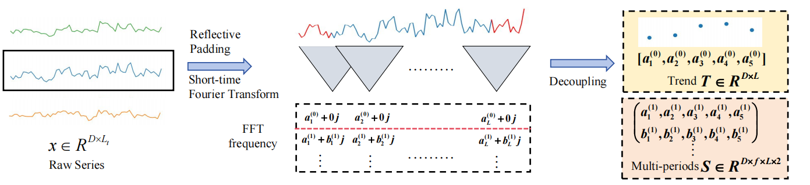
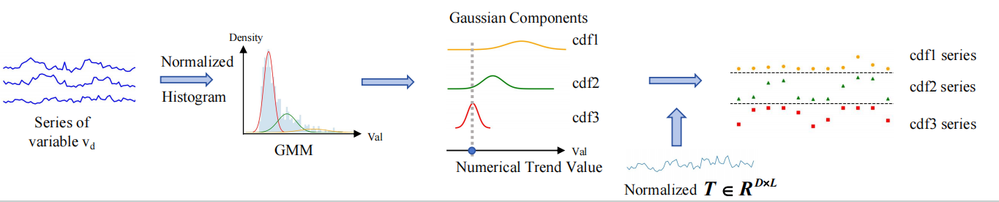

# TrendFormer: Multivariate Time Series Forecasting by Better Decoupling and Predicting Trendy Signals


## Key Points of Trendformer
**1. Short-time Fourier Transform Decoupling**
<p align="center">


<b>Figure 1.</b> Short-time Fourier based Decoupling. 
</p>

**2. Gaussian Mixture Model based Trend Prediction**
<p align="center">


<b>Figure 2.</b> GMM based Trend probabilistic forecasting. 
</p>

**3. Inverted Transformer Backbone and Parameter Sharing Layer**
<p align="center">


<b>Figure 3.</b> Trend Prediction by Inverted Transformer Block. </p>

<p align="center">


<b>Figure 4.</b> Multi-period Parameter-sharing Module.
</p>

## Code Structures
The 'model' dir entails the implementation of different backbones and filters, as well as the loss function and some submodules like attention mechanism.

The 'exp' dir entails the implementation of model training/validation/testing proccess.

The 'data' dir entails the implementation of train/val/test data fetching, histrogram construction, and GMM model learning with scikit-learn.

```
.
├── data
│   └── __init__.py
│   └── data_loader.py
├── datasets
│   └── ETTh1.csv
│   └── ETTm1.csv
│   └── ...
├── exp
│   └── __init__.py
│   └── exp_basic.py
│   └── exp_trendformer.py
├── models
│   └── attn.py
│   └── filter_basic.py
│   └── filter.py
│   └── loss.py
│   └── MLP.py
│   └── PatchTST.py
│   └── trend_former.py
│   └── model_basic.py
├── pic
│   └── img_1.png
│   └── img.png
│   └── MultiPeriod.pdf
│   └── overall.pdf
│   └── Trend.pdf
├── scripts
│   └── ECL_para_search.sh
│   └── ECL.sh
│   └── ....
└── utils
│   └── __init__.py
│   └── metrics.py
│   └── tools.py
├── eval_trendformer.py
├── main_trendformer.py
├── requirements.txt
├── readme.md
├── LICENSE 
```

## Requirements

- Python 3.7.10
- numpy==1.20.3
- pandas==1.3.2
- torch==1.8.1
- einops==0.4.1
- torch==1.9.1+cu111
- statsmodels==0.12.0
- scipy==1.7.3
- scikit_learn==1.0.2
- matplotlib==3.5.3

## Reproducibility
1. Put datasets to conduct experiments into folder `datasets/`. We have already put `ETTh1` and `ETTm1` into it. All datasets can be downloaded from 
https://drive.google.com/drive/folders/13Cg1KYOlzM5C7K8gK8NfC-F3EYxkM3D2?usp=sharing. 

2. To get example results of Trendformer on ETTh1 dataset, run:
```
for pred in 96 192 336 720
do
python main_trendformer.py --data ETTh1 \
--in_len 336 --out_len 720 --pred_len $pred --win_size 24 --hop_len 12 \
--learning_rate 0.002 --itr 5 --e_layers 1 --batch_size 128 --dropout 0.3 \
--d_model 16 --d_ff 32 --train_epochs 20 --patience 20 --warm_train 5 --n_components 1 \
--use_filter --filter stft --use_gmm
done
```
The model will be automatically trained and tested. The trained model will be saved in folder `checkpoints/` and evaluated metrics will be saved in folder `results/`.

3. To reproduce all results in the paper, run following scripts to get corresponding results:
```
bash scripts/ETTh1.sh
bash scripts/ETTh2.sh
bash scripts/ETTm1.sh
bash scripts/ETTm2.sh
bash scripts/WTH.sh
bash scripts/ECL.sh
bash scripts/ILI.sh
bash scripts/Traffic.sh
```

## Acknowledgement
We appreciate the following works for their valuable code and data for time series forecasting:

https://github.com/Thinklab-SJTU/Crossformer

https://github.com/yuqinie98/PatchTST

https://github.com/lucidrains/iTransformer

https://github.com/MAZiqing/FEDformer

